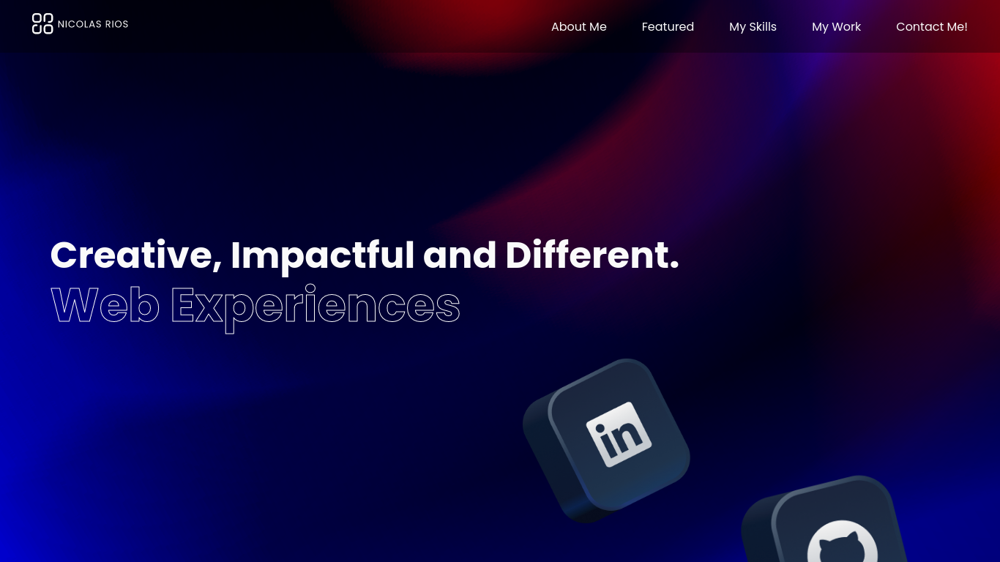

# Personal Portfolio

This is my personal portfolio. Here you will find all my projects and more info about me.

👉 [Live preview](https://nicolasr98.github.io/portfolio/)

## Built with

### Technologies

- HTML5
- Sass
- JavaScript (ES6)

### Tools

- Visual Studio Code
- Linux terminal (ZSH)
- Figma

### Third party code

- [Google Fonts](https://fonts.google.com/)
- [Gradienta.io](https://gradienta.io/)

## Outcome

- Used HTML5 **semantic elements** for better readability and structure.
- Used Sass **partials**, **mixins** and **variables**.
- Used **Git** and **GitHub** for project management.

## Summary

### What I learned

- Better knowledge of **DOM** and **SASS features**.
- Improved a lot with **UX/UI** and **responsive design**.

## Author

👨‍💻 **NicolasR98**
 
 

